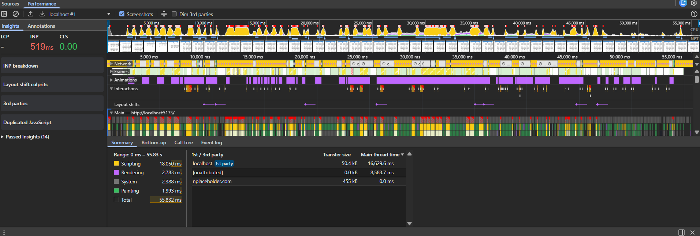
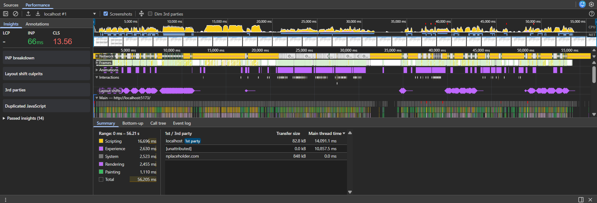

## How to Run and my name

gassyrdaulet 🚀

```bash
# Install dependencies
pnpm install

# Start dev server
pnpm dev

# Build for production
pnpm build

# Lint
pnpm lint
```

## Which challenges I completed:
- Challenge #1: Product List with Infinite Scroll ⭐
- Challenge #2: Advanced Search & Filtering ⭐⭐
- Challenge #3: Performance Optimization ⭐⭐⭐


## Key decisions and trade-offs
1st challenge: 
   For infinite scrolling an useInfinteSCroll hook was created which works with IntersectionObserver.
   Product component was refactored (using sx over style, center loader) and separated to another file.
   Missing key problem was solved just by passing the unique product id value to the "key" prop. If fetching products fails, then we show him the error text and retry button. I think that helps the user experience a lot.

2nd challenge:
   Had to do some separatings, for the code to be more readable. 
   Search and category filtering was added.
   Special hook useDebounce was created to make a delay between searches.
   Chips were used to show which filter is active. They also have button to remove them.
   Mock endpoint was modified to add sorting and price filtering functionality.

3rd challenge:
   Optimized heavy component and other item components with the help of React.memo. Set fixed height for ProductItems and created simple virtualization. Below you can see the metrics from Chrome Dev Tools performance trace (before & after):

   
   

   Faster loading (LCP improved): The largest visible content now appears sooner, making the initial page load feel quicker.

   Better responsiveness (INP improved): User interactions such as clicking and scrolling respond faster due to reduced JavaScript blocking and optimized state updates.

## How to test my features
Fetching products fails:
   Uncomment the block in onLoadMore function for it to randomly throw errors and try to fetch again.
Clear filter functionality:
   To see clear filter functionality simply select some category and type something in search input.
Cart works correctly now:
   Add or subsctract items by pressing "+" or "-", and see the cart updates.
Cancellable requests:
   Press fast on some category and see how the requests cancel in the dev tools.
 
## Some asumptions made by me