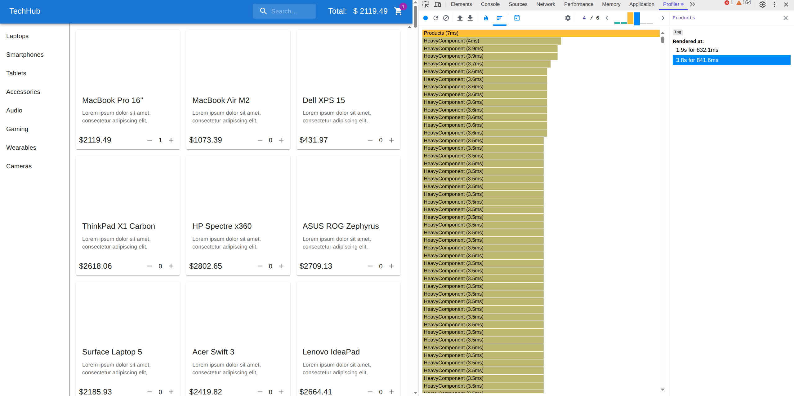
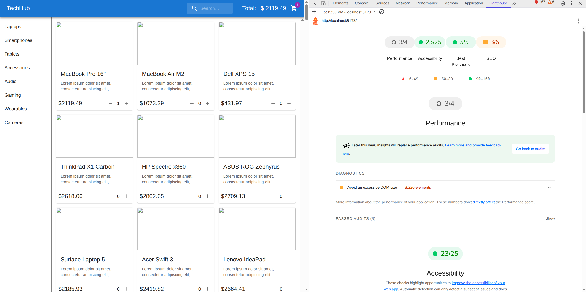
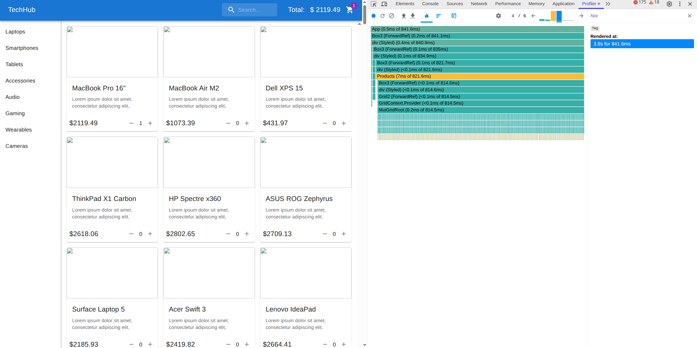
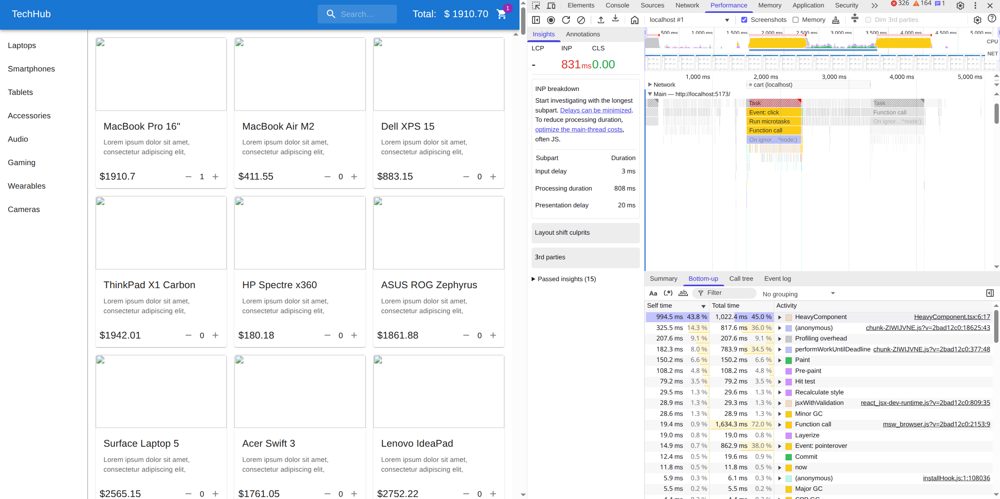
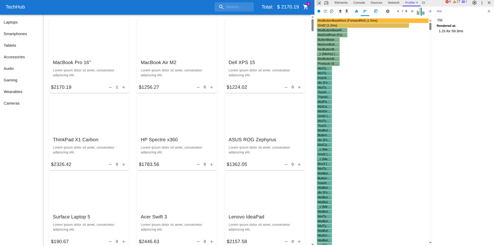
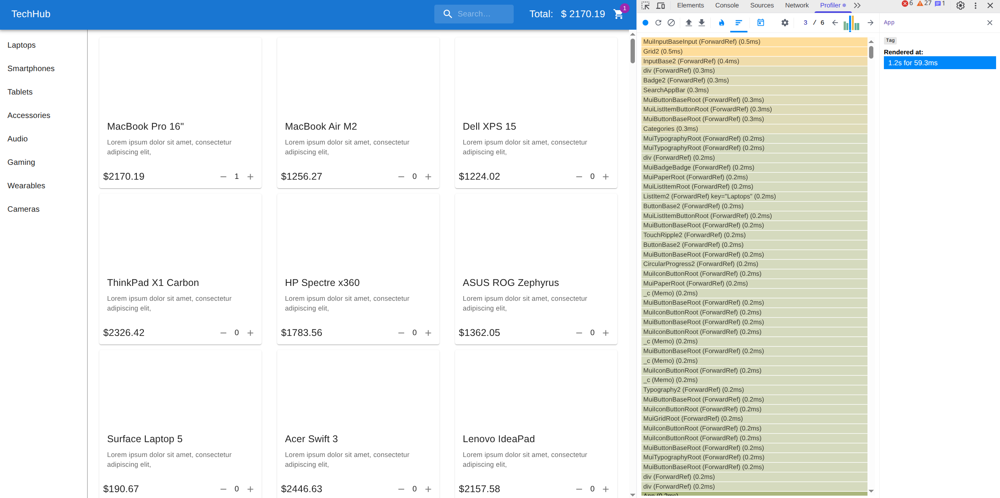
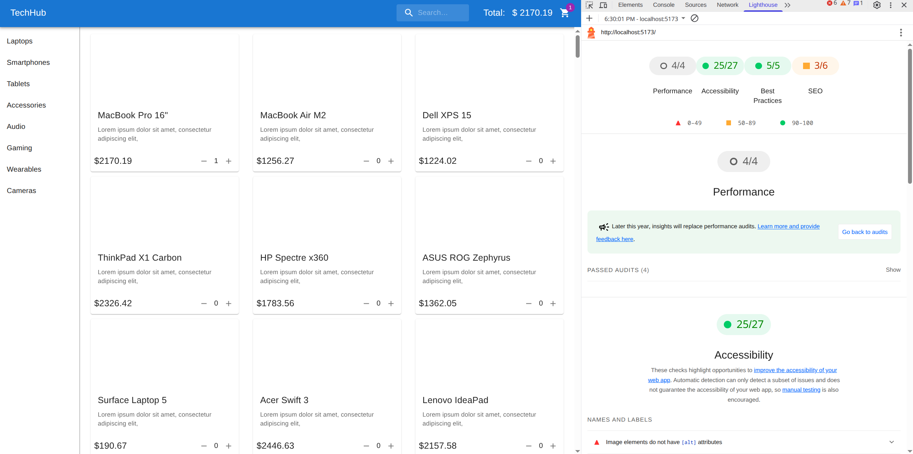
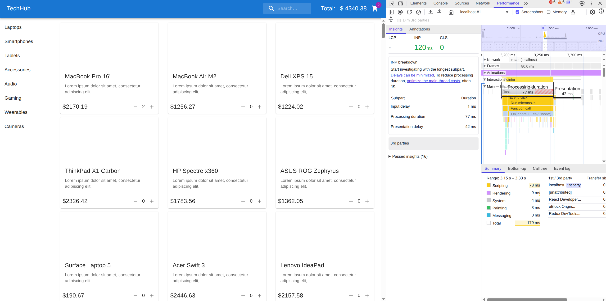

### Info

**Name**: Damir
**Completed challenges**: #3 Performance Optimization and #4 Multi-Step Checkout Flow

---

### Key decisions:

### 1. General State Management
- **Decision:** useState in custom hooks with local storage persistence checkout
- **Trade-off:** Used for simplicity, no external dependencies, less bundle size. Nevertheless, not really scalable. It would be better to use well-maintained and popular libraries like Tanstack Query for asynchronous state management (e.g., management of products, would be great for caching and invalidation) or Zustand for small modular state (external) outside of React (or at least use reducers).

### 2. Form State Management
- **Decision:** useState
- **Trade-off:** Used for simplicity, no external dependencies, less bundle size. Again, not really scalable, and assumes constant rerenders on field value changes. Future-proof solution would be usage of React Hook Form for optimized and complex forms with schema-based validation (need Zod).

### 3. Project Structure
- **Decision:** Simple project structure
- **Trade-off:** Again, used for simplicity. Again, scalability issue. Would be better to use modular architecture.

### 4. Data persistence
- **Decision:** LocalStorage for checkout data storage
- **Trade-off:** Simple solution with no need for backend storage. Nevertheless, would be better to store sensitive data on backend for data security 
and integrity.

### 5. Optimization via memoization
- **Decision:** Add memo, useMemo, useCallback
- **Trade-off:** Reduced number or rerenders for heavy components and functions. Suitable for current case since there are not much props passed into
memoized functions, so React would not be spending too much time for change detection to decide wether to rerender or not.

### 6. Optimization virtualization
- **Decision:** Installed and used react-virtualized
- **Trade-off:** Reduced DOM size and need to paint heavy elements; saved time by using ready-made implementation. Nevertheless, external library increases bundle size and adds complexity to dependency management.

### 7. Optimistic UI updates
- **Decision:** Use optimistic cart item quantity change
- **Trade-off:** Faster UI updates for user. Nevertheless, more code and more possibility to have errors. Also, in case of response failure, user might see rolled back action (optimistic update cancellation).

---

### How to test features:

To test checkout flow, you should click on cart icon in the navigation bar (which shows quantity of items in cart). You can add item to cart and click 
on cart icon button, then checkout dialog will open. Follow 4 steps by adjusting quantity of goods / filling in forms to proceed to confirmation. After pressing "Place Order", you can close dialog via cross button on top of the dialog (by not pressing "Start New Order") to make sure that cart and product quantity is empty (otherwise, "Start New Order" reloads page and cleans localStorage). Placing order may fail due to request, so it will show error and you should press "Retry" and "Place Order" again.

---

### Optimization Screenshots
### Before:

 
 
 

### After:

